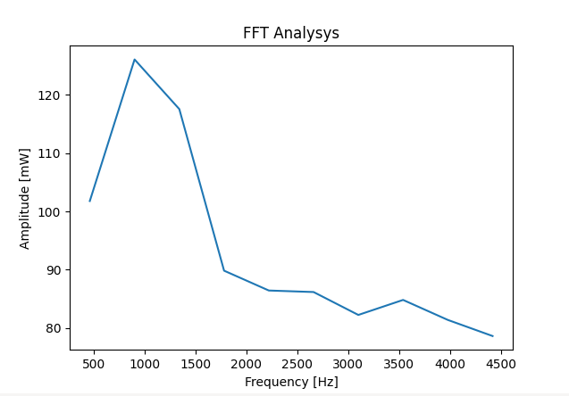

<a name="readme-top"></a>

<p align="center">
  <a href="https://github.com/adkoprek/music_fft/graphs/contributors">
	  
  </a>
  <a href="https://github.com/adkoprek/music_fft/network/members">
	  
  </a>
  <a href="https://github.com/adkoprek/music_fft/stargazers">
	  
  </a>
  <a href="https://github.com/adkoprek/music_fft/issues">
	  
  </a>
  <a href="https://github.com/adkoprek/music_fft/blob/master/LICENSE.txt">
	  
  </a>
</p>
<br />

$$ \LARGE x[k]=\sum\limits_{n=0}^{N-1} x[n]e^\frac{-j2\pi kn}{N} $$
<div align="center">
  <h3 align="center">Music FFt - Music Fast Fourier Transform</h3>

  <p align="center">
    An awesome programm that calculates the FFT
    <br />
    <a href="https://github.com/adkoprek/music_fft/issues/new?labels=bug&template=bug-report---.md">Report Bug</a>
    ·
    <a href="https://github.com/adkoprek/music_fft/issues/new?labels=enhancement&template=feature-request---.md">Request Feature</a>
  </p>
</div>

## About The Project

<p align="center">
  
</p>

The FFT is an very cool algorithem with witch you can extract the base frequencies of a signal, here we look for musical signals in data from instruments. The FFT even saved lifes if you wanna know more about it check out this [Veritasium Video](https://www.youtube.com/watch?v=nmgFG7PUHfo) 

### Built With
[![Python][py.js]][py-url]
  
<!-- GETTING STARTED -->
## Getting Started

If you want your own copy just follow this steps

```bash
git clone https://github.com/adkoprek/music_fft
```

### Prerequisites

The required packages are `csv`, `scipy`, `matplotlib`

## Usage

First place your dump from the picoscope software into the dump/ directory and adjust the base frequency in the code and go nuts!

To run the code
```bash
python main.py
```

## Contributing

Contributions are what make the open source community such an amazing place to learn, inspire, and create. Any contributions you make are **greatly appreciated**.

If you have a suggestion that would make this better, please fork the repo and create a pull request. You can also simply open an issue with the tag "enhancement".
Don't forget to give the project a star! Thanks again!

1. Fork the Project
2. Create your Feature Branch (`git checkout -b feature/AmazingFeature`)
3. Commit your Changes (`git commit -m 'Add some AmazingFeature'`)
4. Push to the Branch (`git push origin feature/AmazingFeature`)
5. Open a Pull Request

## License

Distributed under the MIT License. See `LICENSE.txt` for more information.

## Contact

Adam Korpek - adam.koprek@edu.schulen-Turgi.ch


[py.js]: https://img.shields.io/badge/Python-FFD43B?style=for-the-badge&logo=python&logoColor=blue
[py-url]: https://python.org
[JQuery-url]: https://jquery.com 

